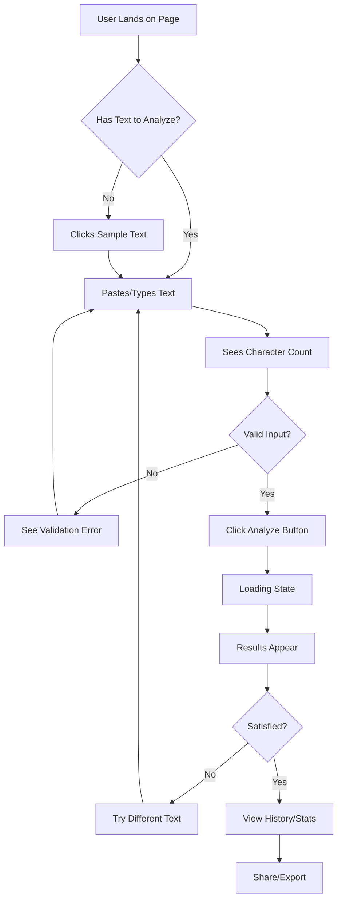

# Product Requirements Document (PRD)
# Sentiment Analysis Frontend Application

**Version:** 1.0  
**Date:** December 11, 2025  
**Author:** Syed Arfan Hussain  
**Status:** Draft → Approved

---

## 1. Executive Summary

### 1.1 Product Overview
A modern, responsive web frontend that provides an intuitive interface for the Sentiment Analysis API. The application will feature real-time sentiment analysis with visual feedback, analysis history, and cache statistics monitoring.

### 1.2 Goals
- **Primary Goal**: Create a production-ready, user-friendly interface that showcases the Sentiment API's capabilities
- **Secondary Goals**: 
  - Demonstrate frontend development skills (React, TypeScript, modern CSS)
  - Provide real-time visual feedback for sentiment analysis
  - Display cache performance metrics in an engaging way
  - Serve as a portfolio piece with professional UX/UI design

### 1.3 Success Metrics
- Page load time < 2 seconds
- Sentiment analysis response time < 100ms (cached) / < 2s (uncached)
- Mobile-responsive on all devices (320px+)
- Accessibility score (Lighthouse) > 90
- Zero console errors in production

---

## 2. Target Audience

### 2.1 Primary Users
- **Technical Recruiters**: Evaluating full-stack capabilities
- **Potential Employers**: Assessing frontend skills and design sensibility
- **Fellow Developers**: Reviewing code quality and architecture
- **End Users**: Testing sentiment analysis for personal/business text

### 2.2 User Personas

**Persona 1: Sarah - Technical Recruiter**
- Needs: Quick understanding of capabilities, professional appearance
- Goals: Assess technical skills within 2 minutes
- Pain Points: Poorly designed demos that don't work on mobile

**Persona 2: Mike - Product Manager**
- Needs: Test sentiment analysis with real business text
- Goals: Evaluate accuracy and speed for potential use case
- Pain Points: Unclear confidence scores, no historical data

**Persona 3: Alex - Fellow Developer**
- Needs: Inspect code quality, architecture decisions
- Goals: Learn from implementation patterns
- Pain Points: Overly complex or poorly documented code

---

## 3. Product Features

### 3.1 Feature Priority Matrix

| Feature | Priority | Complexity | Value | Version |
|---------|----------|------------|-------|---------|
| Sentiment Analysis Input | P0 | Low | High | MVP |
| Real-time Results Display | P0 | Medium | High | MVP |
| Visual Sentiment Indicator | P0 | Medium | High | MVP |
| Analysis History View | P0 | Medium | High | MVP |
| Cache Statistics Dashboard | P1 | Medium | Medium | MVP |
| Dark/Light Mode Toggle | P1 | Low | Medium | V1.1 |
| Export Analysis Data | P2 | Medium | Low | V1.2 |
| Batch Analysis Upload | P2 | High | Medium | V2.0 |

---

## 4. Feature Specifications

### 4.1 Sentiment Analysis Input (P0)

**Description**: Primary interface for users to input text for sentiment analysis.

**Requirements**:
- **Text Input Field**:
  - Multi-line textarea (min height: 120px, auto-expand to 400px)
  - Character counter (0/5000 characters)
  - Real-time validation with visual feedback
  - Placeholder text: "Type or paste your text here to analyze sentiment..."
  
- **Validation Rules**:
  - Minimum: 3 characters
  - Maximum: 5000 characters
  - Error messages: Clear, inline, non-blocking
  
- **Sample Text Buttons**:
  - "Try Positive Example" → Pre-fills positive text
  - "Try Negative Example" → Pre-fills negative text
  - "Clear" → Resets input field

- **Analyze Button**:
  - Primary action button (prominent, colorful)
  - Disabled state when input is invalid
  - Loading state with spinner during API call
  - Keyboard shortcut: Ctrl/Cmd + Enter

**User Flow**:
```
User lands → Sees input field → Types/pastes text → 
Character count updates → Button becomes active → 
Clicks "Analyze" → Loading spinner → Results appear
```

**Edge Cases**:
- Empty input: Button disabled, gentle prompt shown
- Network error: Error message with retry button
- API timeout: "Taking longer than usual" message after 3s
- Very long text: Auto-scroll to results after submission

---

### 4.2 Real-time Results Display (P0)

**Description**: Displays sentiment analysis results with confidence scores and metadata.

**Requirements**:
- **Result Card Layout**:
  - Large sentiment badge (POSITIVE/NEGATIVE)
  - Confidence score (percentage with progress bar)
  - Processing time (with cache hit/miss indicator)
  - Timestamp of analysis
  - Original text snippet (first 100 chars)

- **Visual Design**:
  - POSITIVE: Green color scheme (#81c784)
  - NEGATIVE: Red color scheme (#e57373)
  - Card shadow and subtle animation on appearance
  - Responsive: stacks on mobile, side-by-side on desktop

- **Confidence Visualization**:
  - Progress bar (0-100%)
  - Color gradient based on confidence level
  - Numerical percentage displayed
  - "High confidence" / "Medium confidence" label

- **Performance Metrics**:
  - Processing time in milliseconds
  - Cache status: "⚡ Cached" (green) or "🔄 Processed" (blue)
  - Cache hit: Show time savings vs. uncached

**API Response Handling**:
```typescript
interface SentimentResult {
  text: string;
  sentiment: 'POSITIVE' | 'NEGATIVE';
  confidence: number;  // 0.0 - 1.0
  processing_time_ms: number;
  cached: boolean;
  created_at: string;
}
```

**Animation**:
- Fade-in animation (300ms)
- Confidence bar fills from 0 to actual value
- Smooth scroll to results after analysis

---

### 4.3 Visual Sentiment Indicator (P0)

**Description**: Large, eye-catching visual representation of sentiment result.

**Requirements**:
- **Design Options** (choose one):
  - **Option A**: Emoji + Badge
    - 😊 for POSITIVE (green background)
    - 😞 for NEGATIVE (red background)
    - Large size (80px) with subtle bounce animation
  
  - **Option B**: Gradient Card
    - Full-width card with gradient background
    - Green gradient for POSITIVE
    - Red gradient for NEGATIVE
    - White text overlaid
  
  - **Option C**: Meter/Gauge
    - Semi-circular gauge showing confidence
    - Needle points to POSITIVE or NEGATIVE
    - More sophisticated, dashboard-style

**Recommendation**: Start with Option A (emoji + badge) for MVP, add Option C in V1.1

**Accessibility**:
- Color is not the only indicator (text + icon)
- ARIA labels for screen readers
- High contrast ratios (WCAG AA compliant)

---

### 4.4 Analysis History View (P0)

**Description**: Display recent sentiment analyses with search and filter capabilities.

**Requirements**:
- **History List**:
  - Most recent 10 analyses displayed by default
  - Each item shows:
    - Text snippet (first 50 characters + "...")
    - Sentiment badge
    - Confidence percentage
    - Timestamp (relative: "2 mins ago")
  - Click to expand full details

- **Features**:
  - "Load More" button (pagination, 10 per page)
  - Filter by sentiment (All / Positive / Negative)
  - Sort by: Newest / Oldest / Highest Confidence
  - Search by text content (client-side)
  - "Clear History" button (with confirmation)

- **Empty State**:
  - Message: "No analysis history yet"
  - Call-to-action: "Analyze your first text above!"
  - Illustration or icon

- **Data Management**:
  - Fetch from `/history?limit=10` endpoint
  - Auto-refresh after new analysis
  - Cache in browser localStorage (optional, for performance)

**User Flow**:
```
User scrolls down → Sees history section → 
Can filter/search → Clicks item → Expands details → 
Can re-analyze same text
```

---

### 4.5 Cache Statistics Dashboard (P1)

**Description**: Real-time visualization of Redis cache performance metrics.

**Requirements**:
- **Metrics Display**:
  - **Total Analyses**: Count with icon
  - **Cache Hit Rate**: Percentage with progress ring
  - **Avg Response Time**: Milliseconds comparison (cached vs uncached)
  - **Memory Used**: MB with gauge

- **Visual Components**:
  - Card-based layout (4 cards in grid)
  - Icons for each metric (using icon library)
  - Color coding:
    - Green: Good performance (hit rate > 80%)
    - Yellow: Medium (hit rate 50-80%)
    - Red: Poor (hit rate < 50%)

- **Data Source**:
  - Fetch from `/cache/stats` endpoint
  - Auto-refresh every 30 seconds
  - Manual refresh button

- **Charts** (V1.1 enhancement):
  - Line chart: Hit rate over time
  - Bar chart: Response time comparison
  - Pie chart: Cache hits vs misses

**Layout**:
```
┌─────────────┬─────────────┐
│ Total       │ Cache Hit   │
│ Analyses    │ Rate        │
│             │             │
│ 1,234       │ 87%         │
└─────────────┴─────────────┘
┌─────────────┬─────────────┐
│ Avg Response│ Memory      │
│ Time        │ Used        │
│             │             │
│ 2ms (cached)│ 12.5 MB     │
└─────────────┴─────────────┘
```

---

## 5. Technical Specifications

### 5.1 Technology Stack

**Frontend Framework**: React 18 with TypeScript
- Modern, component-based architecture
- Strong typing for better code quality
- Large ecosystem and community support

**Styling**: 
- **Primary**: Tailwind CSS (utility-first, rapid development)
- **Alternative**: Styled Components (if component-scoped styles preferred)
- **Icons**: Lucide React or Heroicons

**State Management**: 
- React Context API (for simple global state)
- React Query (for API data fetching and caching)

**Build Tool**: Vite
- Fast dev server and HMR
- Optimized production builds
- Better DX than Create React App

**API Client**: Axios
- Interceptors for error handling
- Request/response transformers
- Better error handling than fetch

### 5.2 Project Structure

```
sentiment-frontend/
├── public/
│   └── favicon.ico
├── src/
│   ├── components/
│   │   ├── SentimentAnalyzer.tsx      # Main analysis input/results
│   │   ├── ResultCard.tsx             # Individual result display
│   │   ├── HistoryList.tsx            # Analysis history
│   │   ├── CacheStats.tsx             # Cache dashboard
│   │   ├── Header.tsx                 # App header/nav
│   │   └── Footer.tsx                 # App footer
│   ├── hooks/
│   │   ├── useSentimentAnalysis.ts    # API call hook
│   │   ├── useHistory.ts              # History fetching
│   │   └── useCacheStats.ts           # Cache stats
│   ├── services/
│   │   └── api.ts                     # Axios instance & endpoints
│   ├── types/
│   │   └── index.ts                   # TypeScript interfaces
│   ├── utils/
│   │   ├── formatters.ts              # Date/number formatting
│   │   └── validators.ts              # Input validation
│   ├── App.tsx                        # Root component
│   ├── main.tsx                       # Entry point
│   └── index.css                      # Global styles
├── .env.example
├── .gitignore
├── package.json
├── tsconfig.json
├── vite.config.ts
└── README.md
```

### 5.3 API Integration

**Base URL**: 
- Development: `http://localhost:8000`
- Production: `http://localhost` (nginx proxy)

**Endpoints**:

```typescript
// POST /analyze
interface AnalyzeRequest {
  text: string;
}

interface AnalyzeResponse {
  text: string;
  sentiment: 'POSITIVE' | 'NEGATIVE';
  confidence: number;
  processing_time_ms: number;
  cached: boolean;
}

// GET /history?limit=10
interface HistoryResponse {
  total: number;
  analyses: Analysis[];
}

// GET /cache/stats
interface CacheStatsResponse {
  status: string;
  total_keys: number;
  memory_used_mb: number;
  hits: number;
  misses: number;
  hit_rate: number;
}
```

**Error Handling**:
- Network errors: Retry with exponential backoff
- 4xx errors: Display user-friendly message
- 5xx errors: "Service temporarily unavailable"
- Timeout: After 10 seconds

---

## 6. Design Specifications

### 6.1 Color Palette

**Primary Colors**:
- Blue: `#4fc3f7` (Client, primary actions)
- Green: `#81c784` (Positive sentiment, success)
- Red: `#e57373` (Negative sentiment, errors)
- Orange: `#ffb74d` (Warnings, info)
- Purple: `#ba68c8` (Accents, secondary)

**Neutral Colors**:
- Background: `#f5f5f5` (light mode), `#1a1a1a` (dark mode)
- Card Background: `#ffffff` (light), `#2d2d2d` (dark)
- Text Primary: `#212121` (light), `#e0e0e0` (dark)
- Text Secondary: `#757575` (light), `#9e9e9e` (dark)
- Border: `#e0e0e0` (light), `#424242` (dark)

### 6.2 Typography

**Font Family**: 
- Primary: `Inter, system-ui, sans-serif`
- Monospace: `'Fira Code', 'Courier New', monospace` (for code/metrics)

**Font Sizes** (Tailwind scale):
- Heading 1: `text-4xl` (36px) - Page title
- Heading 2: `text-2xl` (24px) - Section headers
- Heading 3: `text-xl` (20px) - Card titles
- Body: `text-base` (16px) - Default text
- Small: `text-sm` (14px) - Metadata, labels
- Tiny: `text-xs` (12px) - Timestamps, footnotes

**Font Weights**:
- Regular: 400
- Medium: 500
- Semi-bold: 600
- Bold: 700

### 6.3 Spacing & Layout

**Container**:
- Max width: `1280px` (xl breakpoint)
- Padding: `px-4` (mobile), `px-6` (tablet), `px-8` (desktop)

**Component Spacing**:
- Section gaps: `gap-8` (32px)
- Card padding: `p-6` (24px)
- Button padding: `px-6 py-3` (24px x 12px)
- Input padding: `px-4 py-3` (16px x 12px)

**Border Radius**:
- Small: `rounded-md` (6px) - Buttons, inputs
- Medium: `rounded-lg` (8px) - Cards
- Large: `rounded-xl` (12px) - Modal dialogs

### 6.4 Responsive Breakpoints

| Breakpoint | Min Width | Description |
|------------|-----------|-------------|
| sm | 640px | Small tablets |
| md | 768px | Tablets |
| lg | 1024px | Small desktops |
| xl | 1280px | Large desktops |

**Mobile-First Approach**:
- Design for mobile (320px) first
- Progressively enhance for larger screens
- Test on: iPhone SE, iPad, Desktop 1920x1080

---

## 7. User Experience Flow

### 7.1 Primary User Journey



### 7.2 Page Layout (Wireframe)

```
┌───────────────────────────────────────┐
│  🎯 Sentiment Analysis                │  <- Header
│  [About] [API Docs] [GitHub]          │
└───────────────────────────────────────┘

┌───────────────────────────────────────┐
│  Analyze Text Sentiment in Real-Time │  <- Hero Section
│  Powered by DistilBERT & Redis Cache │
└───────────────────────────────────────┘

┌───────────────────────────────────────┐
│  Type or paste your text here...     │  <- Input Section
│  ┌─────────────────────────────────┐ │
│  │                                 │ │
│  │  [Textarea - Multi-line]        │ │
│  │                                 │ │
│  └─────────────────────────────────┘ │
│  Characters: 0 / 5000               │
│  [Try Positive] [Try Negative] [Clear]│
│  [🔍 Analyze Sentiment]   ← Primary CTA│
└───────────────────────────────────────┘

┌───────────────────────────────────────┐
│  📊 Result                            │  <- Results Section
│  ┌─────────────────────────────────┐ │  (Appears after analysis)
│  │  😊 POSITIVE                     │ │
│  │  Confidence: 99.8%               │ │
│  │  ████████████████████░ 99.8%    │ │
│  │  ⚡ Cached (2ms)                 │ │
│  └─────────────────────────────────┘ │
└───────────────────────────────────────┘

┌───────────────────────────────────────┐
│  📜 Recent Analyses                   │  <- History Section
│  ┌─────────────────────────────────┐ │
│  │ "I love this product..." POSITIVE│ │
│  │ 99.9% • 2 mins ago              │ │
│  ├─────────────────────────────────┤ │
│  │ "This is terrible..." NEGATIVE  │ │
│  │ 98.5% • 5 mins ago              │ │
│  └─────────────────────────────────┘ │
│  [Load More]                         │
└───────────────────────────────────────┘

┌───────────────────────────────────────┐
│  📈 Cache Performance                 │  <- Stats Section
│  ┌─────────┬─────────┬──────────────┐│
│  │ Total   │ Hit Rate│ Avg Response ││
│  │ 1,234   │ 87%     │ 2ms          ││
│  └─────────┴─────────┴──────────────┘│
└───────────────────────────────────────┘

┌───────────────────────────────────────┐
│  Built with ❤️ by Syed Arfan         │  <- Footer
│  [GitHub] [LinkedIn] [API Docs]       │
└───────────────────────────────────────┘
```

---

## 8. Development Phases

### Phase 1: MVP (Week 1)
**Goal**: Core functionality working

**Tasks**:
- ✅ Set up Vite + React + TypeScript project
- ✅ Create basic layout structure
- ✅ Implement sentiment input component
- ✅ Connect to `/analyze` API endpoint
- ✅ Display results with basic styling
- ✅ Add history list (basic version)
- ✅ Responsive design (mobile + desktop)
- ✅ Basic error handling
- ✅ Deploy to GitHub Pages / Vercel

**Deliverable**: Working demo URL

### Phase 2: Polish (Week 2)
**Goal**: Professional UX/UI

**Tasks**:
- ⬜ Add animations and transitions
- ⬜ Implement cache stats dashboard
- ⬜ Add loading skeletons
- ⬜ Improve error messages
- ⬜ Add sample text buttons
- ⬜ Implement search/filter in history
- ⬜ Add accessibility features (ARIA labels, keyboard nav)
- ⬜ Performance optimization (code splitting, lazy loading)

**Deliverable**: Production-ready application

### Phase 3: Enhancements (Future)
**Goal**: Advanced features

**Tasks**:
- ⬜ Dark mode toggle
- ⬜ Export analysis data (CSV/JSON)
- ⬜ Charts for cache performance
- ⬜ Batch analysis (upload CSV)
- ⬜ User authentication (optional)
- ⬜ Personal dashboard with saved analyses

---

## 9. Non-Functional Requirements

### 9.1 Performance
- **Page Load**: < 2 seconds (first contentful paint)
- **Time to Interactive**: < 3 seconds
- **API Response**: < 100ms (cached), < 2s (uncached)
- **Bundle Size**: < 500KB (gzipped)

### 9.2 Accessibility
- WCAG 2.1 Level AA compliance
- Keyboard navigation support
- Screen reader compatible
- High contrast mode support
- Focus indicators visible

### 9.3 Browser Support
- Chrome 90+ (primary)
- Firefox 88+
- Safari 14+
- Edge 90+
- Mobile Safari (iOS 14+)
- Chrome Mobile (Android 10+)

### 9.4 Security
- Input sanitization (prevent XSS)
- HTTPS only in production
- CORS headers configured
- Rate limiting on API (handled by backend)
- No sensitive data in localStorage

### 9.5 SEO
- Semantic HTML5 markup
- Meta tags (title, description, OG tags)
- Proper heading hierarchy (H1 → H6)
- Alt text on all images
- Sitemap.xml (if multi-page)

---

## 10. Testing Strategy

### 10.1 Unit Tests
- Component rendering tests (React Testing Library)
- Hook logic tests (custom hooks)
- Utility function tests (formatters, validators)
- Target: 80%+ code coverage

### 10.2 Integration Tests
- API integration tests (mock API responses)
- Form submission flows
- Error handling scenarios
- Cache stats refresh

### 10.3 E2E Tests (Optional)
- Complete user flow (Cypress/Playwright)
- Cross-browser testing
- Mobile device testing

### 10.4 Manual Testing
- Accessibility audit (Lighthouse, axe DevTools)
- Cross-browser testing (BrowserStack)
- Mobile device testing (real devices)
- Performance profiling (Chrome DevTools)

---

## 11. Deployment & DevOps

### 11.1 Development Environment
```bash
# Local development
npm run dev            # Start Vite dev server (localhost:5173)
npm run build          # Production build
npm run preview        # Preview production build
npm run test           # Run tests
npm run lint           # ESLint
```

### 11.2 Deployment Options

**Option 1: Vercel (Recommended)**
- Zero-config deployment
- Automatic HTTPS
- CDN distribution
- Environment variables support
- Free tier available

**Option 2: GitHub Pages**
- Free hosting
- Automatic deployment from main branch
- Custom domain support
- Good for static sites

**Option 3: Netlify**
- Similar to Vercel
- Form handling built-in
- Function support
- Generous free tier

### 11.3 CI/CD Pipeline

```yaml
# .github/workflows/deploy.yml
name: Deploy Frontend
on:
  push:
    branches: [main]
jobs:
  deploy:
    runs-on: ubuntu-latest
    steps:
      - Checkout code
      - Install dependencies
      - Run tests
      - Build production bundle
      - Deploy to Vercel/Netlify
```

### 11.4 Environment Variables

```bash
# .env.development
VITE_API_BASE_URL=http://localhost:8000

# .env.production
VITE_API_BASE_URL=http://localhost  # nginx proxy
```

---

## 12. Documentation Requirements

### 12.1 README.md
- Project overview and features
- Live demo link
- Screenshots/GIF demos
- Installation instructions
- Development setup
- Tech stack details
- API integration details
- Contributing guidelines

### 12.2 Code Comments
- JSDoc comments for complex functions
- Component props documentation
- API service documentation
- Type definitions documented

### 12.3 User Guide (Optional)
- How to use the application
- Tips for best results
- Troubleshooting common issues

---

## 13. Success Criteria

### 13.1 Definition of Done
- ✅ All P0 features implemented and tested
- ✅ Responsive on mobile, tablet, desktop
- ✅ Lighthouse score > 90 (all categories)
- ✅ Zero console errors/warnings
- ✅ API integration working (all endpoints)
- ✅ Deployed to production URL
- ✅ README documentation complete
- ✅ Code reviewed and refactored

### 13.2 Launch Checklist
- [ ] All features working on production
- [ ] Performance optimized (bundle size, lazy loading)
- [ ] Accessibility tested and passing
- [ ] Cross-browser tested
- [ ] Mobile tested on real devices
- [ ] Error handling comprehensive
- [ ] Analytics integrated (optional)
- [ ] Social media preview cards working
- [ ] README and documentation complete
- [ ] GitHub repository organized

---

## 14. Risks & Mitigation

| Risk | Impact | Probability | Mitigation |
|------|--------|-------------|------------|
| API downtime | High | Low | Add offline mode with mock data |
| Slow API response | Medium | Medium | Loading states, timeout handling |
| Browser compatibility | Medium | Low | Polyfills, transpilation, testing |
| Over-engineering | Low | High | Stick to MVP scope, iterate later |
| Poor mobile UX | High | Medium | Mobile-first design, real device testing |

---

## 15. Future Enhancements (Post-MVP)

### V1.1 Features
- Dark mode toggle with system preference detection
- Advanced charts for cache performance over time
- Keyboard shortcuts panel
- Confidence threshold slider (filter results)

### V1.2 Features
- Export analysis history (CSV/JSON/PDF)
- Share result via URL/social media
- API key management (if backend adds auth)
- Custom themes/color schemes

### V2.0 Features
- Batch analysis (upload CSV with multiple texts)
- User accounts and saved analyses
- Comparison view (compare two texts)
- Advanced analytics dashboard
- Sentiment trends over time
- API playground/Postman-like interface

---

## 16. Appendix

### 16.1 Sample Texts for Testing

**Positive Examples**:
- "I absolutely love this product! It exceeded all my expectations and the customer service was fantastic."
- "This is the best experience I've ever had. Highly recommend to everyone!"
- "Amazing quality, fast delivery, and great value for money. Will definitely buy again!"

**Negative Examples**:
- "This is terrible. I'm extremely disappointed with the quality and service."
- "Worst purchase ever. Complete waste of money and time. Do not buy!"
- "Poor quality, slow delivery, and unhelpful customer support. Very frustrated."

**Edge Cases**:
- Empty string: ""
- Very short: "Bad"
- Maximum length: 5000 character text
- Special characters: "I ❤️ this! 🎉🎊"
- Mixed sentiment: "The product is great but the delivery was slow"

### 16.2 API Response Examples

```json
// Positive cached response
{
  "text": "I love this!",
  "sentiment": "POSITIVE",
  "confidence": 0.9998,
  "processing_time_ms": 2,
  "cached": true
}

// Negative uncached response
{
  "text": "This is terrible",
  "sentiment": "NEGATIVE",
  "confidence": 0.9875,
  "processing_time_ms": 98,
  "cached": false
}

// Error response
{
  "detail": "Text must be between 1 and 5000 characters"
}
```

---

## 17. Approval & Sign-off

**Prepared by**: Syed Arfan Hussain  
**Date**: December 11, 2025  
**Status**: Ready for Implementation  

**Next Steps**:
1. Review and approve PRD ✅
2. Set up React + TypeScript project
3. Begin Phase 1 (MVP) implementation
4. Daily progress updates

---

**End of PRD**
